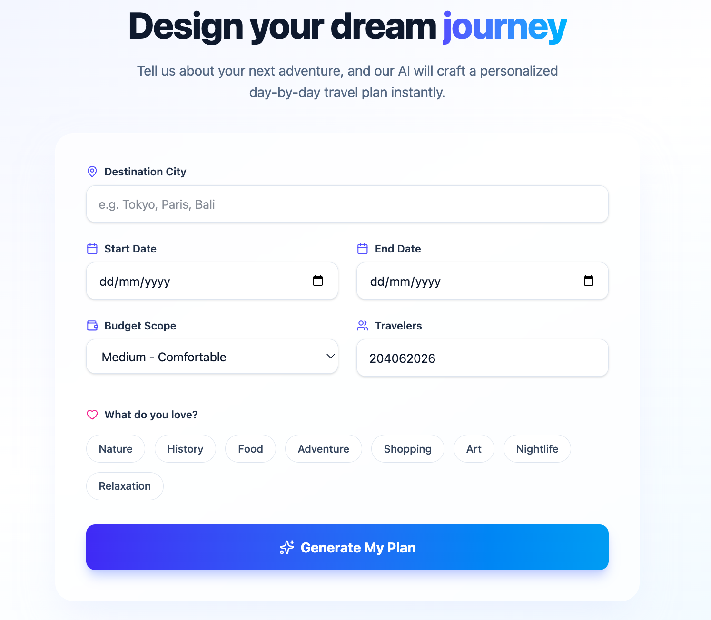
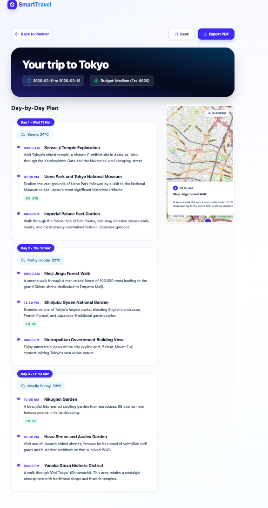

# 🌍 Smart Travel Planner

> **AI-powered, full-stack travel app** that generates personalized day-by-day itineraries — tailored to your budget, interests, travel style, and real-time weather.

---

## 📌 What Is This?

Smart Travel Planner removes the stress of trip planning. Enter your destination, dates, budget, and interests — and the AI builds a complete, logical, day-by-day itinerary in seconds. Every plan comes with an interactive map, weather context, and a downloadable PDF so you're ready before you even pack.

---

## ✨ Key Features

| Feature | Description |
|---|---|
| 🤖 **AI Itineraries** | Google Gemini generates detailed, personalised day-by-day plans |
| 🗺️ **Interactive Maps** | Leaflet + LocationIQ visualise all activities with numbered markers |
| 🌤️ **Weather Forecasts** | Real forecast data (or smart mock data) for smarter activity planning |
| 📄 **PDF Export** | Download your full itinerary as a formatted PDF via `html2pdf.js` |
| 💾 **Save Plans** | Store and retrieve itineraries from a MongoDB database |
| 🎨 **Modern UI** | React + Tailwind CSS 4 with glassmorphism, smooth transitions, and full responsiveness |

---

## 🛠️ Tech Stack

### Frontend
- **React** (Vite) — fast, component-based UI
- **Tailwind CSS 4** — utility-first styling
- **React Router DOM** — client-side routing
- **Leaflet & React-Leaflet** — interactive maps
- **Lucide React** — icon library
- **Axios** — HTTP requests
- **html2pdf.js** — PDF export

### Backend
- **Node.js & Express.js** — REST API server
- **MongoDB & Mongoose** — data persistence
- **@google/generative-ai** — Gemini AI SDK
- **node-fetch** — server-side HTTP requests

---

## 🔑 API Keys Required

Before starting, get the following keys:

| Service | Purpose | Link |
|---|---|---|
| **Google Gemini** | AI itinerary generation | [aistudio.google.com](https://aistudio.google.com/) |
| **LocationIQ** | Map tile rendering | [locationiq.com](https://locationiq.com/) |
| **WeatherAPI** *(optional)* | Live weather forecasts | [weatherapi.com](https://www.weatherapi.com/) |

---

## 🚀 Getting Started

### Prerequisites

- [Node.js](https://nodejs.org/) v16 or higher
- [MongoDB](https://www.mongodb.com/try/download/community) running locally **or** a MongoDB Atlas URI

---

### Step 1 — Clone the Repository

```bash
git clone <repository-url>
cd smart-travel-planner
```

---

### Step 2 — Set Up the Backend

```bash
cd backend
npm install
```

Create a `.env` file inside the `backend/` folder:

```env
PORT=5001
MONGO_URI=mongodb://127.0.0.1:27017/smartTravel
GEMINI_API_KEY=your_gemini_api_key_here
WEATHER_API_KEY=your_weather_api_key_here
```

Start the backend server:

```bash
npm start
# or
node server.js
```

> ✅ Backend will run on `http://localhost:5001`

---

### Step 3 — Set Up the Frontend

Open a **new terminal window**:

```bash
cd frontend
npm install
```

Create a `.env` file inside the `frontend/` folder:

```env
VITE_LOCATIONIQ_API_KEY=your_locationiq_api_key_here
```

Start the development server:

```bash
npm run dev
```

> ✅ App will open at `http://localhost:5173`

---

## 💡 How to Use

```
1. Enter destination      →  e.g. "Tokyo", "Paris", "Bali"
2. Set travel dates       →  pick your start and end dates
3. Choose preferences     →  budget level, number of travelers, interests
4. Click "Generate"       →  AI builds your full itinerary in seconds
5. Explore your plan      →  scroll day-by-day, view locations on the map
6. Save or Export         →  store to database or download as PDF
```

---

## 📁 Project Structure

```
smart-travel-planner/
├── frontend/               # React + Vite app
│   ├── src/
│   │   ├── components/     # UI components
│   │   ├── pages/          # Route pages
│   │   └── main.jsx
│   ├── .env
│   └── package.json
│
├── backend/                # Express + Node.js API
│   ├── routes/             # API route handlers
│   ├── models/             # Mongoose schemas
│   ├── server.js
│   ├── .env
│   └── package.json
│
└── README.md
```
## 📸 Application Screenshots

### 🧭 Travel Planner Interface
This page allows users to enter destination, travel dates, budget, and preferences to generate a personalized trip plan.



---

### 🗺 Generated Travel Itinerary
After generating the plan, the system creates a day-by-day itinerary including locations, time schedule, weather information, and route visualization.


---

## 🤝 Contributing

Contributions, issues, and feature requests are welcome!

1. Fork the repository
2. Create your feature branch: `git checkout -b feature/my-feature`
3. Commit your changes: `git commit -m 'Add my feature'`
4. Push to the branch: `git push origin feature/my-feature`
5. Open a Pull Request

---

<div align="center">

**Built by [Lakshminarayan566](https://github.com/Lakshminarayan566)**


</div>
